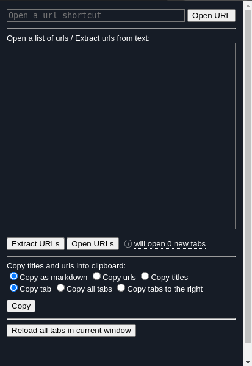
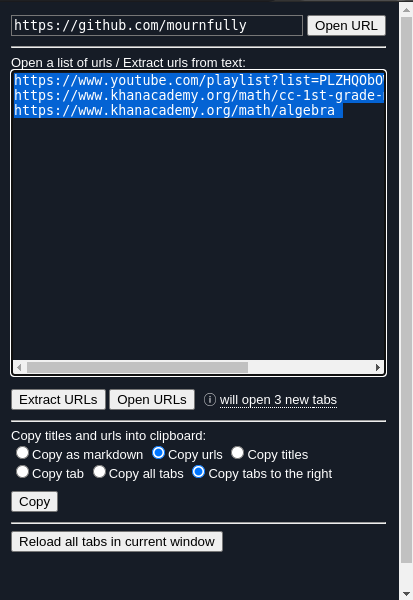

# mournfullys-chromium-toolbox

<p float="center">
    
    &nbsp; &nbsp; &nbsp; &nbsp;
    
</p>

### build from source
```shell
git clone https://mournfully/chrome-extension
cd chrome-extension
npm install
npm run build
# In chrome:
# - go to chrome://extensions
# - enable developer mode
# - load unpacked ~/Downloads/chrome-extension/dist 
```

### references
1. https://github.com/htrinter/Open-Multiple-URLs
2. https://github.com/kiichi/QuickCopyTitleAndURL
3. https://github.com/mohamedmansour/reload-all-tabs-extension
4. https://github.com/refined-github/refined-github
